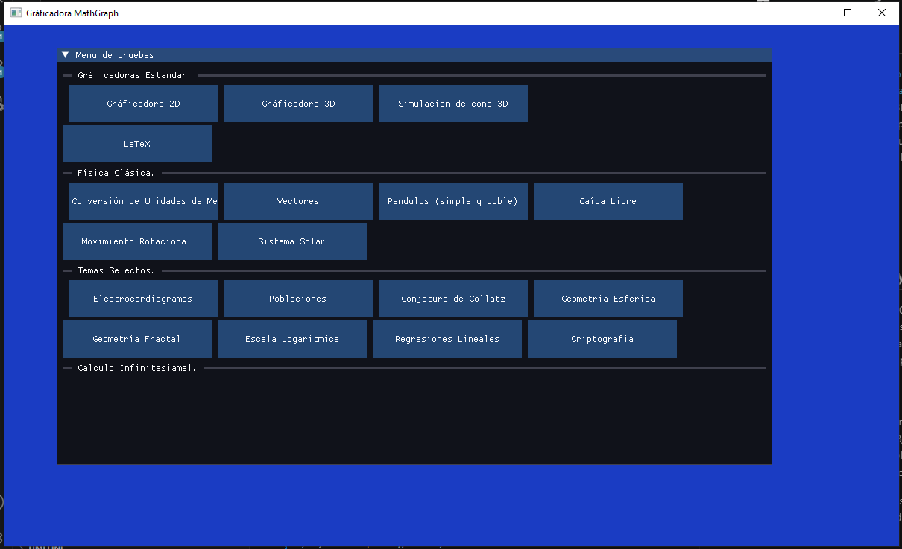
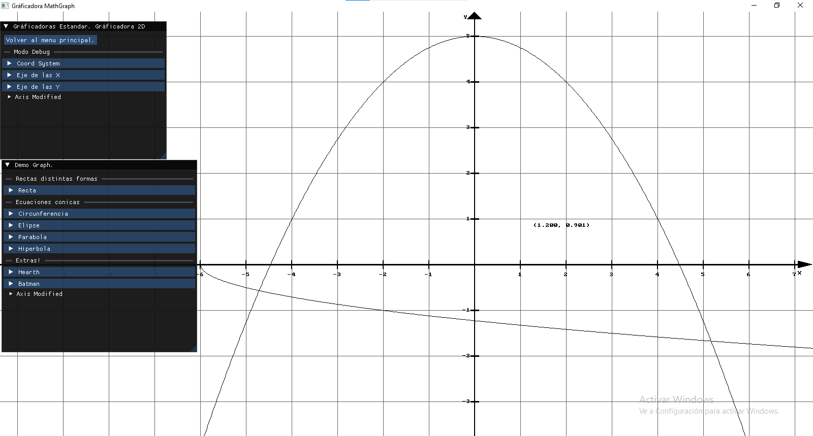
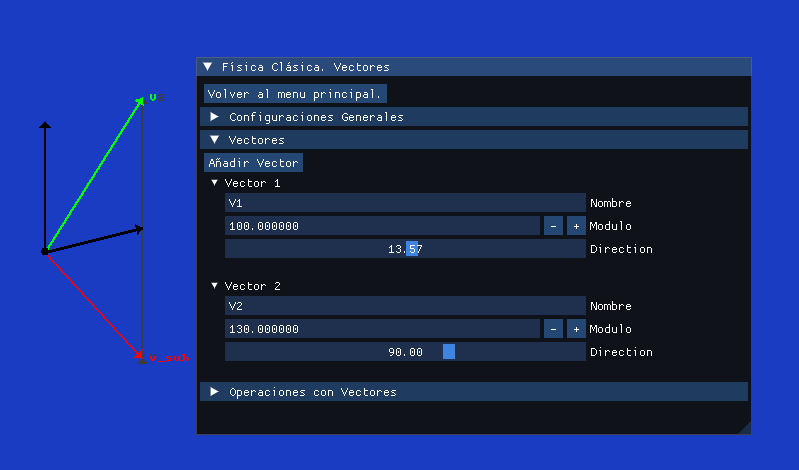

# The Math Project

## Tabla de contenidos 

- 1.0) [Acerca de mi proyecto personal](#10-acerca-de-mi-proyecto-personal)
- 2.0) [Características de la Calculador](#20-características-de-la-calculador)
    - 2.1) [Gráficos 2D y 3D](#21-gráficos-2d-y-3d)
    - 2.2) [Matematicas aplicadas](#22-matematicas-puras)
    - 2.3) [Matematicas Puras](#23-matematicas-puras)
    - 2.4) [Física Clásica y Moderna](#24-física-clásica-y-moderna)
- 3.0) [Librerías que utiliza](#30-librerías-que-utiliza)
    - 3.1) [SDL3](#31-sdl3)
    - 3.2) [Dear ImGui](#32-dear-imgui)
- 4.0) [Como compilar?](#40-como-compilar-este-proyecto)

## 1.0) Acerca de mi proyecto personal
Una calculadora programada en C++. Es un simple experimento académico, por el momento no es nada serio. Busco crearla con funciones multiproposito, más allá de una simple grafícadora. La calculadora tiene aprox. un año de desarrollo antes de haberse públicado este proyecto a GitHub el 5 de Julio del 2026, todo siendo trabajo independiente.

No solo busco repasar y estudiar a más detalle los temas de Matematicas y Fisica que voy a estudiar en la carrera de Fisico-Matematico durante los próximos 5 años (fecha actual. 28/07/2026), si no también a aprender a programar algoritmos más complejos, y entender como estructurar un proyecto de programación de gran tamaño.

Este proyecto al momento no busca ser algo serio más que ser un hobby y un experimento academico de estudio y aprendizaje propio, sin embargo, esta abierto a sugerencias y ayuda de quíen guste ayudar.

## 2.0) Características de la Calculadora
La razón de crear mi propia calculadora gráfica para matematicas y física, viene dado debido a que me interesa aprender experimentando, y gracias a la programación, todo es posible (menos trabajar con atomos, por ahora... **_COMPUTACIÓN CUANTICA!!!!_**). 

Busco realizar simulaciones físicas, aprender grafícos 2D y 3D, y entender con mayor clarídad, objetos matematicos abstractos. A continuación, se detalla cada area en específico:

### 2.1) **Gráficos 2D y 3D** 
Busco entender a más detalle algoritmos de renderizado 2D, y poder representar curvas matematicas, como lo sería una gráficadora tipo [Geogebra](https://www.geogebra.org/). Aprendiendo a rotar y trasladar correctamente las cosas en el plano cartesiando usando las matematicas neesarias directamente en el código.

Para gráficos 3D, busco aprender a transformar coordenadas 3D a un plano 2D, entender el Algebra Lineal detrás de todo ello, y toda la optimización necesaria para ahorrar recursos al momento de renderizar cualquier objeto 3D. 

### 2.2) **Matematicas Aplicadas**
Entender como funcionan modelos matematicos simples y complejos, simulando las herramientas y procesos necesarios para ello. Entender como funciona una población presa-depredador, modelos estadisticos, etc.

### 2.3) **Matematicas Puras**
Justamente entender con mayor claridad objetos matematicos desde los más conocidos como lugares geometrícos (_Geometría Analítica_), derivadas (_Calculo Diferencial_), integrales (_Calculo Integral_), matrices (_Algebrá Lineal_), algebra vectorial (_Analisis Vectorial_), entre muchos otros objetos matematicos que se planea incluir dentro del proyecto. 

Aparte más conocido, haré mi mejor esfuerzo para poder incluir objetos más abstractos y menos conocidos, buscando estudiarlos y entenderlos al mismo tiempo (aunque añado que muchos de ellos será dificil debido a la complejidad que representar siquiera entenderlos).

### 2.4) **Física Clásica y Moderna**
Busco entender simulando en tiempo real, como funcionan fenomenos fisicos entendiendolos de mejor forma utilizando el poder computacional de un procesador. Ver como cambian las cosas en tiempo real, permite entenderlas mejor más que solo ver pura teoría en libro y libreta. Aunque sean simulaciones, se tiene que dejar claro que son aproximaciones y no hay nada mejor que ver las cosas en la vida real.

Desde física clásica, trabajando con los clásicos vectores, entendiendo fuerzas, aceleración y velocidad, rotaciónes de cuerpos, gravitación universal... hasta también incluir física moderna, llendonos a campos más complejos como modelos atomicos más allá del de Bohr y adentrandonos al de Schrodinger, relatividad especial, agujeros negros... no lo sé realmente ahora mismo que escribo esto, pero espero entenderlos proximamente y verlos funcionar en código. 

> [!NOTE]
> Muchas de estas características siguen en desarrollo, o no estan implementadas directamente.

## 3.0) Librerías que utiliza 
El proyecto esta estructurado gracias a librerías externas que facilitan mucho el uso de funciones ya optimizadas para agilizar las cosas. Aquí estan las que se utilizan dentro del proyecto.

> [!IMPORTANT]
> Hay funciones que ya poseen estas librerías que se pueden implementar de forma eficaz, solo que aveces puede que las omita debido a que quiero experimentar como funciona realmente el algoritmo detrás de esas funciones, o aveces, simplemente desconozco (cuando sucede asi, duele.)

### 3.1) **SDL3**
"Simple DirectMedia Layer es una biblioteca de desarrollo multiplataforma diseñada para proporcionar acceso de bajo nivel a hardware de audio, teclado, mouse, joystick y gráficos a través de OpenGL/Direct3D/Metal/Vulkan. Lo utilizan software de reproducción de vídeo, emuladores y juegos populares, incluido el galardonado catálogo de Valve y muchos juegos de Humble Bundle."

> Traducido directamente al español desde la página oficial de [SDL3](https://wiki.libsdl.org/SDL3/FrontPage)

**Repositorio de GitHub**: <ins> https://github.com/libsdl-org/SDL </ins>

### 3.2) **Dear ImGui**
Dear ImGui es una biblioteca de interfaz gráfica de usuario sin sobrecarga para C++. Genera buffers de vértices optimizados que puedes renderizar en cualquier momento en tu aplicación habilitada para canalización 3D. Es rápido, portátil, independiente del renderizador y autónomo (sin dependencias externas).

> Traducido directamente al español desde el [README.md](https://github.com/ocornut/imgui/blob/master/docs/README.md) del repositorio de GitHub

**Repositorio de GitHub**: <ins>https://github.com/ocornut/imgui</ins>

## 4.0) ¿Como compilar este proyecto?
No lo sé, ahora mismo me da flojera escribir la documentación de esto lol.